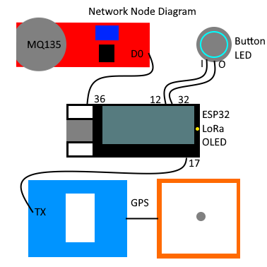

# Network Node Instructions
## Hardware
### Hardware Diagram


### Parts Required
*ESP32
*LoRa module
*OLED
*GPS
*Button with LED
*MQ135 Gas Sensor

### Assembly
The ESP32 dev board used is a TTGO LoRa32 v1, which has the ESP32, LoRa module, and OLED onboard, as well as both a button and an LED. This module is placed on a breadboard, where a 3v3 pin and a GND pin are connected to the + and - rails of the breadboard.

The GPS TX pin is connected to pin 17, which is UART2 on the ESP32 (accessed via Serial2), and VCC and GND are connected to the + and - rails respectively.

The MQ135 gas sensor requires 5v to operate correctly, as it utilises a heating element inside the sensor. Because of this, the MQ135 GND pin can be connected to the - rail, but the VCC pin MUST be connected to a 5v pin, and not the 3v3 rail.
The MQ135 gas sensor has two outputs, a digital output which goes high when the sensor value exceeds the calibrated level, and an analog output that allows a more precise reading. As the ESP32 GPIO are 5v tolerant, the digital pin can be directly connected to pin 36 on the ESP32 board, however the analog pin is connected through a voltage divider to pin 37. This is because the ESP32 ADC only ranges from 0v to 3v3, so by dividing the output, the sensor voltage ranges from 0-2v5 which stays within the range of the ADC.

The button with LED that is used in the demo has inbuilt current limiting resistor, however if your LED button does not have this it will require a current limiting resistor to prevent burning out the LED. Similarly, the onboard LED also has a current limiting resistor.

## Software
The codebase for this project uses VSCode and PlatformIO with the LoRa library by Sandeep Mistry and the inbuilt Arduino library. The other required libraries are included in this repository in the `lib/` directory.
When building the code for a network node device, ensure the mode is set to `MODE_NETWORK` in the `config.h` file:
```cpp
// Uncomment the desired configuration
#define MODE_NETWORK
//#define MODE_PERSONAL
```

The `secrets.h` file contains the network configuration, such as the band to use
```cpp
// Access credentials for the network and groups
#define NETWORK_BAND            434E6
#define NETWORK_KEY        "C0DEBA5E"

#define PUBLIC_NET_ACCESS  "DEADBEEF"
#define CONTROL_NET_ACCESS "8BADF00D"
#define ALERT_NET_ACCESS   "00BADBAD"

#define NETWORK_TX_TIMEOUT_MS   10000
```

Using 434MHz is legal in Austrlia for non specific and research use using low powered devices with limited transmission rates, hence the 10 seconds transmission timeout. This timeout can be reduced when using other bands or if using a license, however if the timeout is too short (<2s), there is a risk of messages looping in the network.

## Network Node Usage
The network nodes can be used by simply powering up the nodes using a high capacity power supply. The power draw of the network nodes exceeds 200mA due to the heater in the MQ135, so average power draw is considered as 250mA, meaning a 40 hours run time from a 10,000mAh battery pack. Adding a small solar panel to recharge the battery bank can give an indefinite runtime as long as the panels are exposed to the sun.

The network nodes will only be in an alert state while the MQ135 sensor detects a hazardous gas, and will automatically reset when the air quality recovers, unlike the personal nodes. This allows for a node to realert if the air quality decreases again, possibly indicating an additional fire after the first is extinguished, or reignition.

The test button can be used to send a test page to all other nodes on the network, including personal nodes.

To change frames on the display, simply press the onboard button, and the onboard LED will light up and the frame will change. Holding down the button will not continuously cycle the frames.
