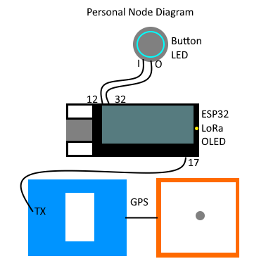

# Personal Node Instructions
## Hardware
### Hardware Diagram


### Parts Required
*ESP32
*LoRa module
*OLED
*GPS
*Button with LED

### Assembly
The ESP32 dev board used is a TTGO LoRa32 v1, which has the ESP32, LoRa module, and OLED onboard, as well as both a button and an LED. This module is placed on a breadboard, where a 3v3 pin and a GND pin are connected to the + and - rails of the breadboard.

The GPS TX pin is connected to pin 17, which is UART2 on the ESP32 (accessed via Serial2), and VCC and GND are connected to the + and - rails respectively.

The button with LED that is used in the demo has inbuilt current limiting resistor, however if your LED button does not have this it will require a current limiting resistor to prevent burning out the LED. Similarly, the onboard LED also has a current limiting resistor.

## Software
The codebase for this project uses VSCode and PlatformIO with the LoRa library by Sandeep Mistry and the inbuilt Arduino library. The other required libraries are included in this repository in the `lib/` directory.
When building the code for a personal node device, ensure the mode is set to `MODE_PERSONAL` in the `config.h` file:
```cpp
// Uncomment the desired configuration
//#define MODE_NETWORK
#define MODE_PERSONAL
```

The `secrets.h` file contains the network configuration, such as the band to use
```cpp
// Access credentials for the network and groups
#define NETWORK_BAND            434E6
#define NETWORK_KEY        "C0DEBA5E"

#define PUBLIC_NET_ACCESS  "DEADBEEF"
#define CONTROL_NET_ACCESS "8BADF00D"
#define ALERT_NET_ACCESS   "00BADBAD"

#define NETWORK_TX_TIMEOUT_MS   10000
```

Using 434MHz is legal in Austrlia for non specific and research use using low powered devices with limited transmission rates, hence the 10 seconds transmission timeout. This timeout can be reduced when using other bands or if using a license, however if the timeout is too short (<2s), there is a risk of messages looping in the network.

## Personal Node Usage
Personal nodes can be run off a single cell lipo, such as an 18650, for multiple days given its low idle power draw. To recharge the battery, simply connect a micro USB cable to the board and led the onboard charging handle the battery.

When a page is received, the display will show the new message, and pressing the button will clear the message. Unlike the network nodes, personal nodes remain in an alert state until they are reset, minimising the risk of accidentally clearing an alert.
When an alert is received, the personal node will display the alert, the button LED will turn on, and the alert message will be stored. The message can be cleared like a page, however the alert will not be cleared.

To change frames on the display, simply press the onboard button, and the onboard LED will light up and the frame will change. Holding down the button will not continuously cycle the frames.
